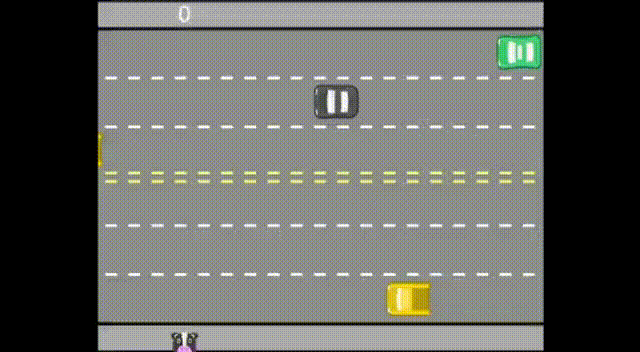
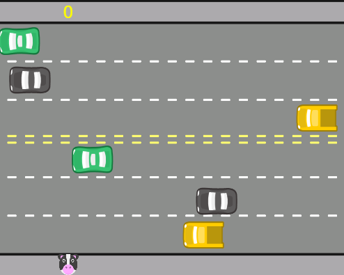
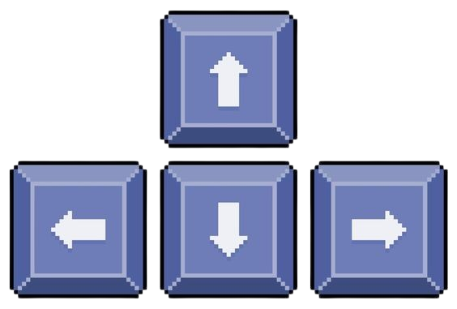
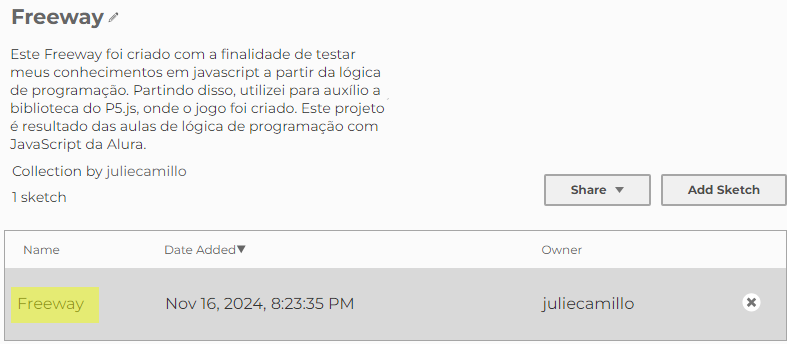
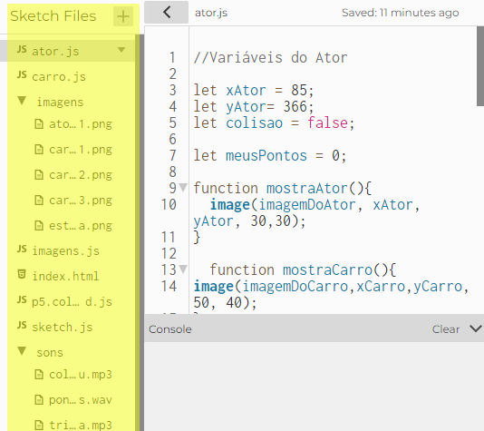
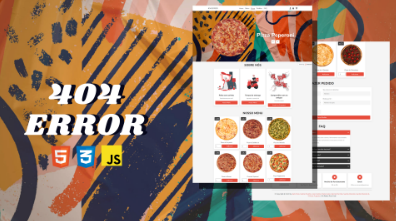
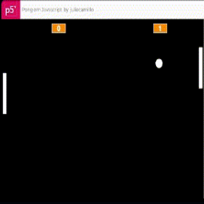

<h1 align= "center"> Freeway </h1>

*  [Versão em Português](#versao-em-portugues)

<br>

*  [Versión en español](#versión-en-español)

<br>

*  [English Version](#english-version)

<br> 

 

O freeway é um jogo que tem como objetivo fazer seu personagem atravessar a rua sem que ele colida com os carros que vêm em múltiplas velocidades. 

## Sumário

* [Introdução](#introdução)
* [Como funciona](#como-funciona)
* [Tecnologias Utilizadas](#tecnologias-utilizadas)
* [Acessando o projeto](#acessando-o-projeto)


## Introdução

Criado na década de 80, o freeway é um jogo onde o jogador controla um personagem que deve atravessar a estrada sem colidir com os carros. Este Freeway foi criado com a finalidade de testar meus conhecimentos em javascript a partir da lógica de programação. Partindo disso, utilizei para auxílio a biblioteca do P5.js, onde o jogo foi criado. 
Este projeto é resultado das aulas de lógica de programação com JavaScript da Alura.





## Como funciona

Para começar a jogar, clique no botão de play ▶️. Os carros começarão a andar, sons ligados, o jogo tá funcionando!

Para mexer o nosso personagem, uma vaquinha, utilize as setas do seu teclado (direita, cima, esquerda, baixo). Cuidado ao voltar hein!



<br>

### Quer uma dica? 👀

Fique de olho no tempo em que cada carro passa, cada um tem tempo diferente! 

Ao atravessar a estrada, você ganha um ponto! Mas, ao colidir com algum carro, você volta pra plataforma e perde o ponto anterior.

## Tecnologias Utilizadas

- [Javascript](https://www.javascript.com/): Linguagem predominante. Utilizada para criar o jogo e dar vida, com movimentação do personagem principal (a vaquinha) e os carros, com sons e música;

- [HTML](https://developer.mozilla.org/pt-BR/docs/Web/HTML): Linguagem de Marcação usada para guardar os valores dos arquivos externos (imagens, sons, biblioteca, e outros arquivos javascript);

- [CSS](https://www.css3.com): Linguagem de estilo usada para manipular a estrutura da tela;


## Acessando o Projeto 

Este projeto foi desenvolvido no [p5.js Web Editor](https://editor.p5js.org/).  


Você pode acessá-lo diretamente através do link abaixo:


### **[Minha Coleção no p5.js](https://editor.p5js.org/juliecamillo/collections/Lx339H41A)**

<br>

- Clique no projeto "Freeway" 

<br>



<br>

e depois roda o play!

<br>


<br>


<br>

Agora você pode jogar seu jogo e ver as mudanças feitas nele enquanto isso. Legal não é?

<br>



<br>

> **Nota:** Este projeto foi desenvolvido usando o p5.js, que já inclui funcionalidades e trechos de código próprios da plataforma. Por isso, apenas o código de minha autoria está disponível aqui, respeitando as diretrizes de direitos autorais.

<br>

```
Créditos: Alura p5.js
Crédito gif: Matteus Moreno

```

## Curtiu o projeto?

Dê uma espiadinha em outros! E me acompanhe no [LinkedIn](www.linkedin.com/in/julie-camilo-da-silva-dev) para saber dos meus próximos projetos!

### [404 Error](https://github.com/JulieCamilo/404ERROR)

<br>



<br>

A ideia do site 404 ERROR surgiu a partir da necessidade de testar e aprimorar os meus conhecimentos e dos meus colegas de grupo. O 404 ERROR é um site de pizzaria responsivo criado em 4 linguagens diferentes para o projeto final do curso técnico de tecnologia da informação.


### [Pong](https://github.com/JulieCamilo/Pong)

<br>



O Pong é um jogo eletrônico com a temática de tênis de mesa e, é um dos primeiros jogos eletrônicos lucrativos da história e é a partir de sua criação que, na Alura, exercitamos nossa lógica de programação.


## Versión en español

<h1 align= "center"> Freeway </h1>

*  [Versão em Português](#versao-em-portugues)

<br>

*  [Versión en español](#versión-en-español)

<br>

*  [English Version](#english-version)

<br> 

 

Freeway es un juego cuyo objetivo es hacer que tu personaje cruce la calle sin chocar con los autos que pasan a múltiples velocidades.

## Resumen

* [Introducción](#introducción)
* [Cómo funciona](#cómo-funciona)
* [Tecnologías Utilizadas](#tecnologías-utilizadas)
* [Cómo ejecutarlo](#accediendo-al-proyecto-en-p5js)

## Introducción

Creado en la década de 1980, Freeway es un juego donde el jugador controla un personaje que debe cruzar la carretera sin chocar con los autos. Esta versión de Freeway fue creada para poner a prueba mis conocimientos en JavaScript mediante lógica de programación. Como apoyo, utilicé la biblioteca P5.js, que fue esencial para el desarrollo del juego.
Este proyecto es el resultado de las lecciones de lógica de programación con JavaScript de Alura.


## Cómo funciona

Para comenzar a jugar, haz clic en el botón de play ▶️. ¡Los autos empezarán a moverse, los sonidos estarán activados, y el juego estará listo!

Para mover a nuestro personaje, una vaquita, utiliza las flechas de tu teclado (derecha, arriba, izquierda, abajo). ¡Cuidado al retroceder!

 

<br>


### ¿Quieres un consejo? 👀

¡Presta atención al tiempo que tarda cada auto en pasar, cada uno tiene un ritmo diferente!

Al cruzar la carretera, ¡ganas un punto! Pero si chocas con un auto, vuelves a la plataforma y pierdes el último punto obtenido.

## Tecnologías Utilizadas

- [JavaScript](https://www.javascript.com/): El lenguaje principal. Usado para crear el juego y darle vida con movimientos del personaje principal (la vaquita) y los autos, incluyendo sonidos y música;

- [HTML](https://developer.mozilla.org/pt-BR/docs/Web/HTML): Lenguaje de marcado utilizado para gestionar los valores de los archivos externos (imágenes, sonidos, bibliotecas y otros archivos JavaScript);

- [CSS](https://www.css3.com): Lenguaje de estilo utilizado para manipular el diseño de la pantalla;


## Accediendo al Proyecto en p5.js

Este proyecto fue desarrollado en el [p5.js Web Editor](https://editor.p5js.org/).

Puedes acceder directamente al enlace a continuación:

### **[Mi Colección en p5.js](https://editor.p5js.org/juliecamillo/collections/Lx339H41A)**

<br>

- Haz clic en el proyecto "Freeway"

<br> 


<br>

y luego dale al play!

<br>


<br>

<br>
  
   Ahora puedes jugar tu juego y ver los cambios realizados en tiempo real. ¿Genial, verdad? 
   
   <br>
   
    

<br>

> **Nota:** Este proyecto fue desarrollado utilizando p5.js, que incluye características y fragmentos de código propios de la plataforma. Por eso, solo mi código original está disponible aquí, respetando las directrices de derechos de autor.

<br>

```

Créditos: Alura p5.js  
Crédito del GIF: Matteus Moreno  

```

## ¿Te gustó el proyecto?


¡Echa un vistazo a otros! Y sígueme en [LinkedIn](www.linkedin.com/in/julie-camilo-da-silva-dev) para estar al tanto de mis próximos proyectos.


### [404 Error](https://github.com/JulieCamilo/404ERROR)

<br>


<br>

La idea del sitio 404 ERROR surgió de la necesidad de probar y mejorar mis habilidades y las de mis compañeros de grupo. 404 ERROR es un sitio web responsivo de pizzería creado en cuatro lenguajes diferentes como parte del proyecto final del curso técnico en tecnología de la información.


### [Pong](https://github.com/JulieCamilo/Pong)

<br>


Pong es un videojuego con temática de tenis de mesa y uno de los primeros videojuegos rentables de la historia. En Alura, usamos su creación para ejercitar nuestra lógica de programación.

## English version

<h1 align= "center"> Freeway </h1>

* [Portuguese Version](#versão-em-português)

<br>

*  [Spanish Version](#versión-en-español)

<br>

*  [English Version](#english-version)

<br>

 

Freeway is a game where the objective is to make your character cross the street without colliding with cars that come at multiple speeds.

## Summary

* [Introduction](#introduction)
* [How it works](#how-it-works)
* [Technologies Used](#technologies-used)
* [Acessing the project](#acessing-the-project)

## Introduction

Created in the 1980s, Freeway is a game where the player controls a character who must cross the road without colliding with cars. This version of Freeway was created to test my knowledge of JavaScript through programming logic. For support, I used the P5.js library, which was instrumental in developing the game.
This project is the result of the JavaScript programming logic lessons from Alura.


## How it works

To start playing, click the play button ▶️. The cars will start moving, sounds will play, and the game is ready to go!

To move our character, a little cow, use the arrow keys on your keyboard (right, up, left, down). Be careful when going back!

 

<br>

## Want a tip? 👀

Pay attention to the timing of each car passing by—each one moves at a different pace!

When you successfully cross the road, you earn a point! But if you collide with a car, you return to the platform and lose the last point you gained.

## Technologies Used

- [JavaScript](https://www.javascript.com/): The main language. Used to create the game and bring it to life with movement for the main character (the cow) and the cars, including sounds and music;

- [HTML](https://developer.mozilla.org/pt-BR/docs/Web/HTML): Markup language used to manage external file values (images, sounds, libraries, and other JavaScript files);

- [CSS](https://www.css3.com): Style language used to manipulate the screen layout;

## Accessing the Project 

This project was developed in the [p5.js Web Editor](https://editor.p5js.org/).

You can access it directly through the link below:

### **[My Collection on p5.js](https://editor.p5js.org/juliecamillo/collections/Lx339H41A)**

<br>

- Click on the "Freeway" project

<br>


<br>

and then hit play!

<br>


<br>

<br> 

Now you can play your game and see the changes you make in real time. Cool, right?

<br>


<br>

> **Note:** This project was developed using p5.js, which includes built-in features and code snippets provided by the platform. For this reason, only my original code is available here, respecting copyright guidelines.

<br>

```
Credits: Alura p5.js  
GIF Credit: Matteus Moreno 

```

## Enjoyed the project?

Take a look at my other ones! And follow me on [LinkedIn](www.linkedin.com/in/julie-camilo-da-silva-dev) to stay updated on my upcoming projects!

### [404 Error](https://github.com/JulieCamilo/404ERROR)

<br>

  
 
 <br>
The idea for the 404 ERROR website came from the need to test and improve my knowledge and that of my groupmates. 404 ERROR is a responsive pizzeria website built using four different languages as the final project for the IT technical course.

### [Pong](https://github.com/JulieCamilo/Pong)

<br>


Pong is a video game with a table tennis theme and one of the first profitable electronic games in history. At Alura, we used its creation to practice our programming logic.

